<div align="center">
  <a href="https://git.io/typing-svg">
    
  </a>
</div>

<div align="center">

| **Crate**           | **Version**                                                                                             | **Docs**                                                                                              |
| --- | --- | --- |
| `weavetui`         | [](https://crates.io/crates/weavetui)             | [](https://docs.rs/weavetui)                         |
| [`weavetui_core`](https://github.com/mzyui/weavetui/tree/main/weavetui_core)     | [](https://crates.io/crates/weavetui_core) | [](https://docs.rs/weavetui_core)             |
| [`weavetui_derive`](https://github.com/mzyui/weavetui/tree/main/weavetui_derive)   | [](https://crates.io/crates/weavetui_derive) | [](https://docs.rs/weavetui_derive)         |

<br>

[](https://github.com/mzyui/weavetui/actions/workflows/rust.yml)
[](https://opensource.org/licenses/MIT)
[](CONTRIBUTING.md)

</div>

---

`weavetui` is a modern, robust, and modular **Text User Interface (TUI) framework** for Rust, designed to simplify the development of sophisticated and interactive terminal applications. This repository serves as both the primary application showcasing the framework's capabilities and the foundational crates that enable its powerful component-based architecture.

## ✨ Why `weavetui`?

`weavetui` empowers developers to build complex and interactive terminal applications with ease, offering:

*   **Component-Driven Development:** Build UIs using reusable, self-contained components, making your code modular and maintainable.
*   **Reduced Boilerplate:** Leverage procedural macros to automatically implement common traits, allowing you to focus on your application's unique logic.
*   **Robust Event Handling:** A flexible and comprehensive event system handles keyboard, mouse, and custom events, ensuring a responsive user experience.
*   **Clear Architecture:** A well-defined separation of concerns between core functionalities (`weavetui_core`) and macro-based development (`weavetui_derive`) promotes clarity and extensibility.
*   **Interactive & Responsive:** Designed from the ground up to deliver engaging and fast-responding user interfaces directly within the terminal.

## 🚀 Getting Started

These instructions will get you a copy of the project up and running on your local machine for development and testing purposes.

### Prerequisites

*   Rust programming language (stable or beta channel recommended). You can install it via `rustup`:
    ```bash
    curl --proto '=https' --tlsv1.2 -sSf https://sh.rustup.rs | sh
    ```
*   Cargo, Rust's package manager (comes with Rust installation).

### Installation

1.  **Clone the repository:**
    ```bash
    git clone https://github.com/weavetui/weavetui.git
    cd weavetui
    ```

2.  **Build the project:**
    This command will compile all crates within the workspace (`weavetui`, `weavetui_core`, `weavetui_derive`).
    ```bash
    cargo build --release
    ```
    Using `--release` is recommended for optimized performance.

### Running the Application

To launch the `weavetui` example application (which demonstrates the framework's capabilities):

```bash
cargo run --release
```

This command compiles and runs the main `weavetui` application, serving as a practical demonstration of the framework's features directly in your terminal.

## 📂 Project Structure

This repository is organized as a Rust workspace, containing the following crates:

*   `weavetui/` (root): The main application crate that orchestrates the UI and application logic, serving as a practical demonstration of the framework.
*   `weavetui_core/`: A foundational library defining core TUI traits (`Component`, `ComponentAccessor`), event handling mechanisms, and utility functions.
*   `weavetui_derive/`: A procedural macro crate providing the `#[component]` attribute for automatic trait implementation, simplifying component creation.

## ⚙️ How `weavetui` Works: A Simplified Overview

`weavetui` simplifies TUI development in Rust through a component-based architecture and powerful procedural macros. Here's a breakdown of its core mechanics:

```mermaid
graph TD
    subgraph " Phase 1: Compile Time"
        A[Developer writes Component Struct & adds &#91;component&#93;] --> B{Rust Compiler};
        B --> C[`weavetui_derive` Crate];
        C --"Macro &#91;component&#93; active"--> D[Implementation of `Component` & `ComponentAccessor` traits is automatically generated];
        D --> E[Complete Component Code];
    end

    subgraph "Phase 2: Runtime"
        F[`weavetui` Application starts] --> G[Terminal Initialization & `ComponentManager`];
        G --> H{Main Event Loop};

        subgraph "Event & Render Cycle"
            H --"Waiting for input..."--> I[User provides input &#40;Keyboard/Mouse&#41;];
            I --> J[`EventHandler` from `weavetui_core`];
            J --"Event distributed"--> K[`ComponentManager`];
            K --"Finds active component & calls `handle_key_events`"--> L[Active Component];
            L --"1. Internal state is modified"--> L;
            L --"2. Returns 'Action' (optional)"--> M{Action Handling};
            M --"Action processed (e.g., 'quit', 'submit')"--> H;
            K --"Triggers render process after event"--> N[Render Engine];
            N --"Calls `draw()` on each visible component"--> O[Each Component];
            O --"Renders view to buffer"--> P[Terminal Buffer];
            P --> Q[Terminal Display updated];
            Q --> H;
        end
    end

    style A fill:#f9f,stroke:#333,stroke-width:2px
    style C fill:#f9f,stroke:#333,stroke-width:2px
    style F fill:#ccf,stroke:#333,stroke-width:2px
    style I fill:#ccf,stroke:#333,stroke-width:2px
```



### Detailed Explanation

1.  **Define Your UI as Components**: You start by defining your UI elements as Rust `struct`s. By adding the `#[component]` attribute from `weavetui_derive` to your struct, you tell the framework that this struct should behave as a UI component.

2.  **Automatic Trait Implementation (Compile Time)**:
    *   During compilation, the `#[component]` macro automatically generates the necessary boilerplate code.
    *   Specifically, it implements the `Component` and `ComponentAccessor` traits (defined in `weavetui_core`) for your struct. These traits provide the fundamental methods for handling events, drawing the UI, and managing component properties. This automation significantly reduces manual coding.

3.  **Application Lifecycle (Runtime)**:
    *   **Initialization**: When your `weavetui` application starts, it sets up the terminal environment and initializes a `ComponentManager`. This manager is the central orchestrator, responsible for holding all your UI components and managing their state and interactions.
    *   **Event Loop**: The application then enters a continuous loop, constantly monitoring for user input (like key presses or mouse clicks) and internal events, and triggering UI updates as needed.

4.  **Event Handling Flow**:
    *   **Input Capture**: When a user interacts with the terminal (e.g., presses a key), the `EventHandler` (from `weavetui_core`) captures this input.
    *   **Event Distribution**: The captured event is then passed to the `ComponentManager`.
    *   **Component Action**: The `ComponentManager` identifies the currently active component and dispatches the event to its `handle_key_events` (or `handle_mouse_events`) method. Here, your component's logic processes the event, potentially modifying its internal state (e.g., updating a counter, changing a selected item).
    *   **Actions & Communication**: After processing an event, a component can optionally return an `Action` (e.g., a command like `"quit"` or `"submit"`). These actions are a primary way for components to communicate with the `ComponentManager` or other parts of the application, triggering broader changes or application-level responses.

5.  **Rendering the UI**:
    *   After events are processed, the `ComponentManager` initiates a re-render of the UI.
    *   The rendering engine iterates through all visible components, calling their `draw()` method.
    *   Each component draws its visual representation onto an in-memory buffer.
    *   Once the buffer is complete, its contents are efficiently sent to the terminal, updating what the user sees on the screen.

6.  **Continuous Interaction**: This entire cycle of event handling and rendering repeats rapidly, creating the illusion of a fluid, interactive, and responsive terminal application.

## 🧪 Running Tests

To ensure the stability and correctness of the framework and application, you can run the test suite:

```bash
cargo test
```

This command will execute all unit and integration tests across all workspace crates.

## 🤝 Contributing

We welcome and encourage contributions from the community! Whether you're looking to report a bug, suggest an enhancement, or contribute code, please refer to our [CONTRIBUTING.md](CONTRIBUTING.md) for detailed guidelines on how to get involved.

## 🗺️ Roadmap

*   Enhanced layout management system.
*   More sophisticated styling and theming capabilities.
*   Expanded set of pre-built UI components.
*   Improved accessibility features.
*   Comprehensive documentation and tutorials.

## 📄 License

This project is licensed under the MIT License. See the [LICENSE](LICENSE) file for details.